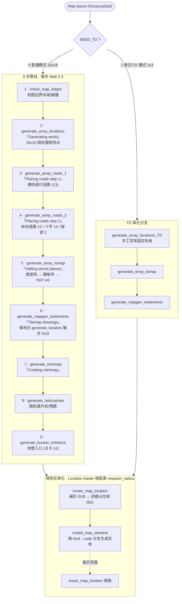
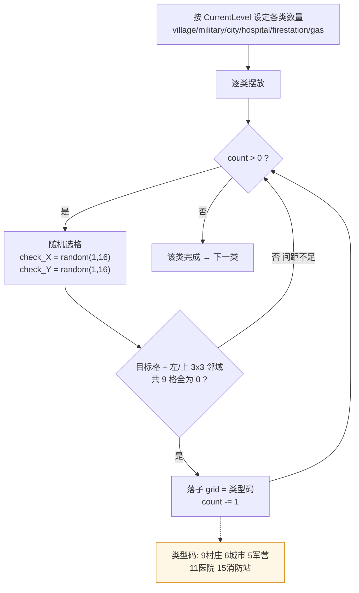
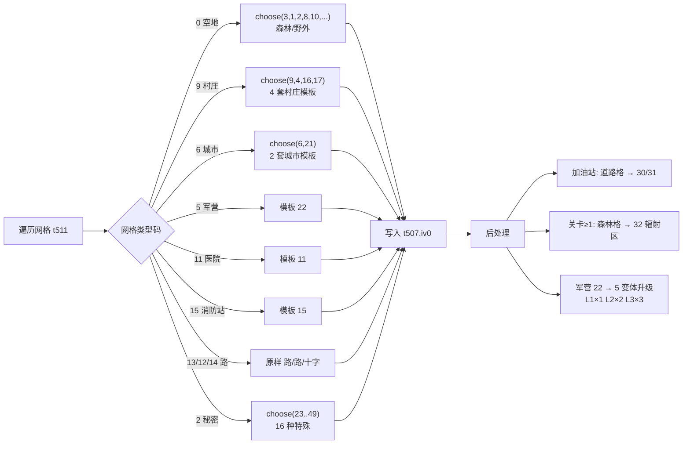
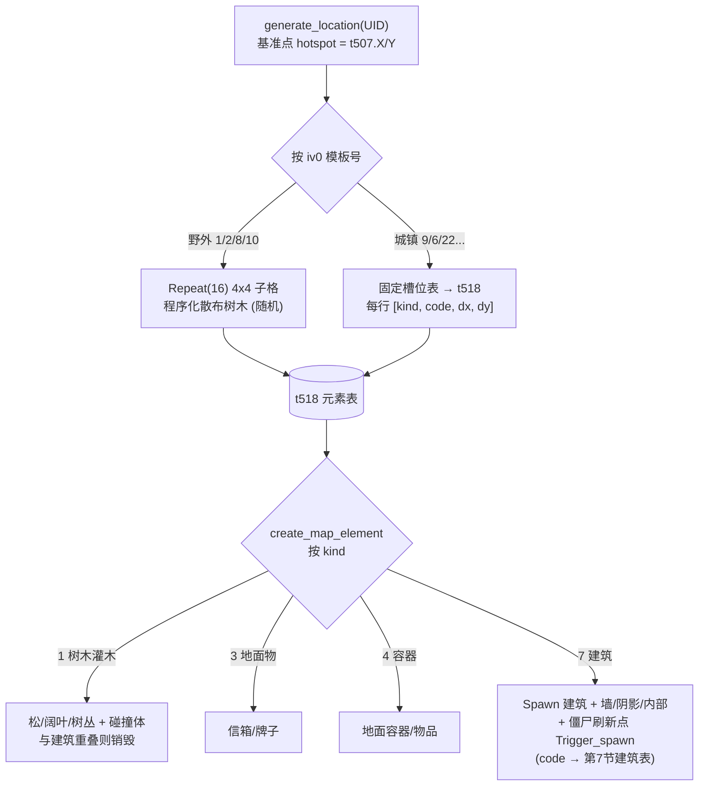

# 城镇生成逻辑（世界地图生成全流程）

> 本文从 `original_docs/data.js`（Construct 2 导出的混淆事件表）解码而来，目标是**完整说明世界地图 / 城镇是如何生成的，以便复刻**。
>
> 解码工具：`handler/decode_events.py`，输出可读伪代码：`文档/datajs_export/map_generation.decoded.txt`。
> 所有逻辑都在事件表 `Game_events` 的顶层分组 **`Map generation`** 里，通过 Construct 2 的 `Function` 对象（`t180`）按函数名调用完成。

---

## 0. 一句话总览

世界地图是一个 **16×16 的格子（grid）**。每个格子先被填上一个“地点类型码”（村庄/城市/军营/医院……或道路/空地），然后：

1. 用道路把同行/同列的地点连起来；
2. 把每个格子的类型码翻译成一个**模板号**（同一种地点有多套模板，随机选一套）；
3. 每套模板里有一组**固定坐标的建筑槽位**，槽位里的具体建筑再 `choose(...)` 随机。

所以你看到的现象——**所有城镇间距一样、布局骨架一样、只是建筑换皮**——正是因为：格子间距固定（1020 像素），模板的槽位偏移写死，只有“槽位里放哪栋楼”是随机的。

---

## 1. 生成管线（调用顺序）

地图布局名为 `"Map"` 的 layout 启动时（`OnLayoutStart`，且 `SEED_TD = 0` 普通模式），按以下顺序调用函数。每步之间 `Wait(0.3)` 并更新加载文案（对应 `l_eng_ui.xml` 里的字符串）：

| 步骤 | 函数 | 加载文案 | 作用 |
|------|------|----------|------|
| 1 | `check_map_edges` | — | 设置地图边界水域/碰撞 |
| 2 | `generate_array_locations` | Generating world | **在 16×16 格子里随机摆放各类地点** |
| 3 | `generate_array_roads_1` | Placing roads (step 1) | 横向（按行）连接地点 → 道路 |
| 4 | `generate_array_roads_2` | Placing roads (step 2) | 纵向（按列）连接、生成交叉路口、放置秘密地点 |
| 5 | `generate_array_tomap` | Adding secret places | **把格子类型码翻译成模板号**，写入每个地点标记 `t507` |
| 6 | `generate_mapgen_toelements` | Tilemap drawings | 对每个地点标记调用 `generate_location` 展开成实际元素 |
| 7 | `generate_minimap` | Creating minimap | 生成小地图 |
| 8 | `generate_helicrashes` | — | 随机摆放直升机/特殊残骸 |
| 9 | `generate_bunker_entrance` | — | 随机摆放地堡入口（关卡 ≥1） |

> 每一步只是“填数据 / 摆标记”，真正把一栋楼实体化是在玩家走近时由 `Location loader` 分组的 `create_map_location` → `create_map_element` 惰性完成的（见第 8 节）。

`SEED_TD = 1`（每日种子 / TD 模式）走另一条简化分支：固定 **3×3** 格子，调用 `generate_array_locations_TD`（手工写死的固定布局）→ `generate_array_tomap` → `generate_mapgen_toelements`。

---

## 2. 核心数据结构

| 对象 | 类型 | 含义 |
|------|------|------|
| `t511` | Array | **地点网格**，尺寸 `Map_size_X × Map_size_Y`，每格存一个“地点类型码” |
| `t507` | Sprite (`mapgen`) | **地点标记**，每个格子对应一个，世界坐标固定。实例变量：`iv[1]=格Y`、`iv[2]=格X`、`iv[0]=模板号`、`iv[9]=已占用标记` |
| `t518` | Array | **单个地点的“待生成元素”表**，每行 `[kind, code, x, y, ...]` |
| `t697` | Array | roads_2 里收集“可放秘密地点”的候选格 |
| `t501` | Sprite | 元素占位体，携带 `iv[1]=kind`、`iv[2]=code`，由 `create_map_element` 翻译成实体 |
| `t180` | Function | 函数调度对象（所有 `generate_*` 都是它的函数） |

**全局变量默认值**（事件变量声明）：

```
Map_size_X = 16      Map_size_Y = 16     // 普通地图 16×16（TD 模式改为 3×3）
```

### 2.1 格子 → 世界坐标

`t507` 标记在 `OnLayoutStart` 时按格子线性铺开（`Repeat(Map_size_X * Map_size_Y)`，`loopindex` = i）：

```
X = 700 + floor(i / Map_size_X) * 1020
Y = 320 + (i mod Map_size_Y)     * 1020
iv[1] (格Y) = floor(i / Map_size_X)
iv[2] (格X) = i mod Map_size_Y
```

**关键常数：格距 = 1020 像素。** 每个地点占据约 1000×1000 的世界区域，模板里建筑偏移范围正好是 `+0 ~ +1000`。
之后整体 `SetPos(X+500, Y+500)` 做一次居中偏移。

> 这就是“城镇间距永远一样”的根因：标记位置由格子索引线性决定，与随机无关。随机只发生在“哪个格子放什么类型”和“槽位里放哪栋楼”。

---

## 3. `generate_array_locations` —— 地点摆放

### 3.1 每关地点数量

按 `CurrentLevel` 设定各类地点数量（写进局部计数器，逐个摆放后递减）：

| CurrentLevel | villages | militaries | cities | hospitals | firestations | gas_stations |
|:---:|:---:|:---:|:---:|:---:|:---:|:---:|
| 0 | 20 | 0 | 3 | 1 | 1 | 1 |
| 1 | 15 | 2 | 5 | 2 | 2 | 2 |
| 2 | 6 | 4 | 10 | 3 | 3 | 3 |
| 3 | 3 | 6 | 11 | 4 | 2 | 4 |

> 关卡越深，村庄越少、城市/军营越多。还会同时设定天气 `rains_level`、计时 `Timer_ALL`、每基地僵尸数 `Zed_per_base`（按难度 Novice/Regular/Veteran 微调）等。

### 3.2 摆放算法（每类地点都一样）

对每一类（村庄/军营/城市/医院/消防站）执行一个 `While` 循环，直到该类计数归零：

```
While (count > 0):
    check_X = round(random(1, Map_size_X))      // 随机选一个格子
    check_Y = round(random(1, Map_size_Y))
    // 要求目标格及其左/上方一圈共 9 个格子都为空(=0)，保证间距：
    if  grid(check_X,   check_Y)   == 0 and
        grid(check_X-1, check_Y-1) == 0 and
        grid(check_X-2, check_Y-1) == 0 and
        grid(check_X-2, check_Y-2) == 0 and
        grid(check_X-1, check_Y)   == 0 and
        grid(check_X,   check_Y-1) == 0 and
        grid(check_X,   check_Y-2) == 0 and
        grid(check_X-2, check_Y)   == 0 and
        grid(check_X-1, check_Y-2) == 0:
            grid(check_X-1, check_Y-1) = <类型码>   // 落子
            count -= 1
```

> **要点**：落子前要求一个 3×3 邻域全空，这就是“城镇彼此不会贴在一起”的机制——每个地点至少隔开 ~2 格（约 2040px）。失败就重新随机，直到放满。

### 3.3 地点类型码（写入 `t511` 网格的值）

| 码 | 含义 | 码 | 含义 |
|:--:|------|:--:|------|
| 0 | 空地 / 森林 | 11 | 医院 hospital |
| 9 | 村庄 village | 15 | 消防站 firestation |
| 6 | 城市 city | 13 | 横向道路（roads_1 生成） |
| 5 | 军营 military | 12 | 纵向道路（roads_2 生成） |
| 2 | 秘密地点（roads_2 生成） | 14 | 十字路口（roads_2 生成） |

---

## 4. `generate_array_roads_1 / _2` —— 道路网

道路把地点连成路网，逻辑是“同一行/列的地点之间填路”。

**roads_1（横向，逐行）**：对每一行，从左到右找出该行前两个“地点格”（类型 9/6/11/15）的列号 `anotherX`、`anotherX2`，把它们之间的空格填成 `13`（横向路）。

**roads_2（纵向，逐列）**：同理逐列找地点，把它们之间：
- 已是横向路 `13` 的格 → 改成 `14`（十字路口）；
- 空格 `0` → 填成 `12`（纵向路）。

**秘密地点**：roads_2 最后扫描整张网格，把“周围一圈为空、且坐标在 2~15 范围内”的格子收集进 `t697`，随机抽一个写成 `2`（秘密地点），`secret_location -= 1`。

---

## 5. `generate_array_tomap` —— 类型码 → 模板号

遍历网格 `t511`，按 `t507.iv[1]==格Y && t507.iv[2]==格X` 找到对应地点标记，把网格类型码翻译成**模板号**写入 `t507.iv[0]`：

| 网格码 | → 模板号 `iv[0]` | 说明 |
|:--:|------|------|
| 0 | `choose(3,1,2,8,10,1,2,8,10)` | 空地：森林/野外（1/2/8/10 权重翻倍） |
| **9（村庄）** | **`choose(9,4,16,17)`** | **4 套村庄排列模板** |
| **6（城市）** | **`choose(6,21)`** | **2 套城市排列模板** |
| 5（军营） | `22` | 军营模板 |
| 11（医院） | `11` | |
| 15（消防站） | `15` | |
| 13 / 12 / 14 | `13 / 12 / 14` | 路 / 路 / 十字 |
| 1 | `20` | |
| 2（秘密） | `choose(23,24,25,26,27,28,29,40,42,43,44,45,46,47,48,49)` | 16 种特殊地点之一 |
| 50–57 / 99 / 100 / 101 | 原样 | 教程 / 特殊 |

翻译后还有几处后处理：

- **加油站**：`Repeat(gas_stations)` 次，从道路格（模板号 12/13）里 `PickRandom` 一个，改成 `30`（横向加油站）/`31`（纵向加油站）。
- **关卡 ≥1**：从森林格（2/8/1/10/3）随机挑一个改成 `32`（辐射/特殊区）。
- **军营 22 → 5**：L1 改 1 个、L2 改 2 个、L3 改 3 个（`PickRandom`），把部分军营升级为不同变体。

---

## 6. `generate_location` —— 模板展开成元素表 `t518`

`generate_mapgen_toelements` 对每个 `t507` 调用 `generate_location(UID)`。函数先取该地点的世界坐标作为基准点：

```
hotspotX = t507.X
hotspotY = t507.Y
```

然后**按 `iv[0]` 模板号分支**，往 `t518` 数组里逐行写入“待生成元素”。每个槽位写 4 列：

```
col 1 = code   （建筑/物体编号，可为 choose(...) 或 random）
col 2 = x      （= hotspotX + 固定偏移）
col 3 = y      （= hotspotY + 固定偏移）
col 0 = kind   （元素种类标签，见下表）
```

`kind`（col 0）取值：

| kind | 含义 |
|:--:|------|
| 7 | 建筑（由 `create_map_element` 的 kind=7 分支实体化） |
| 6 | 随机物体（**清一色车辆**，`random(N)` 选车型，见 §7.1） |
| 3 | 特殊单体 |
| 1 | 树木/灌木（`choose(1..6)`） |
| 其他 | 地面物、特殊装饰等 |

> **野外（模板 1/2/8/10）** 不是固定槽位，而是用 `Repeat(16)` 在 4×4 子格里**程序化散布树木**（`PlantX = hotspotX+50+random(150)+250*col`，`PlantY` 同理），所以森林看起来是随机的；而城镇是**固定槽位 + 槽内随机**。

### 6.1 村庄模板 type 9（11 个建筑槽，最典型）

| # | kind | code（choose=随机） | dx | dy |
|:--:|:--:|------|:--:|:--:|
| 1 | 建筑 | `choose(9,10,11,12,13)` | +844 | +91 |
| 2 | 建筑 | `choose(9,10,11,12,13)` | +865 | +344 |
| 3 | 建筑 | `choose(9,10,11,12,13)` | +115 | +901 |
| 4 | 建筑 | `choose(9,10,11,12,13)` | +346 | +901 |
| 5 | 建筑 | `choose(4,5,3)` | +736 | +675 |
| 6 | 建筑 | `choose(4,5,3)` | +855 | +675 |
| 7 | 建筑 | `choose(4,5,3)` | +974 | +675 |
| 8 | 建筑 | `choose(4,5,3)` | +736 | +861 |
| 9 | 建筑 | `choose(4,5,3)` | +855 | +861 |
| 10 | 建筑 | `choose(4,5,3)` | +974 | +861 |
| 11 | 建筑 | `choose(8,17)` | +260 | +238 |
| — | 物体×3 | `random(12)` | +635/+100+r/+650+r | … |
| — | 特殊 | `2` | +696 | +345 |
| — | 树×9 | `choose(1,2,3,4,5,6)` | 多处 | 多处 |

> 即：4 栋村屋（颜色随机）+ 6 个车库/棚 + 1 个棚或超市 + 杂物/树。**坐标骨架固定，建筑换皮**。

### 6.2 其余村庄模板槽位数

| 模板 | 建筑槽 | 总槽位 |
|:--:|:--:|:--:|
| 9 | 11 | 24 |
| 4 | 8 | 21 |
| 16 | 5 | 29（含大量篱笆 kind=4 + 树） |
| 17 | 6 | 20 |

### 6.3 城市模板 type 6（6 个建筑槽）

| kind | code | dx | dy |
|:--:|------|:--:|:--:|
| 建筑 | `choose(27,28,30)` | +153 | +248 |
| 建筑 | `choose(27,28,30)` | +378 | +248 |
| 建筑 | `choose(27,28,30)` | +153 | +750 |
| 建筑 | `choose(27,28,30)` | +378 | +750 |
| 建筑 | `choose(27,28,30)` | +859 | +750 |
| 建筑 | `choose(15,17,19,32,39)` | +848 | +155 |
| 物体×2 | `random(12)` | … | … |
| 树×4 | `choose(1..6)` | … | … |

城市模板 type 21 类似，6 个建筑槽，含写死的 `29`（city_house_3）×2 + `choose(27,28,30)`。
两套城市模板都会先 `CreateObject(t397,"Buildings", hotspot+500)` 铺一块 1000×1000 的城市地面底图。

---

## 7. 建筑编号 → 实际建筑对象

`code`（col 1）的取值对应下表（由 `create_map_element` 的 kind=7 分支映射到具体建筑对象，名字取自其精灵图）：

| code | 建筑 | code | 建筑 | code | 建筑 |
|:--:|------|:--:|------|:--:|------|
| 2 | b_dot | 14 | b_village_yard | 28 | b_city_house_2 |
| 3 | b_garage_blue | 15 | b_piano_house | 29 | b_city_house_3 |
| 4 | b_garage_blue | 16 | b_church | 30 | b_city_house_4 |
| 5 | b_garage_green | 17 | b_supermarket | 31 | b_car_bus |
| 7 | b_small_shed | 18 | b_school | 32 | b_village_red2 |
| 8 | b_shed | 19 | b_police_station | 33 | b_red_brick |
| 9 | b_village_brown | 20 | b_fire_station | 34 | b_military_barrack2 |
| 10 | b_village_red | 21 | b_hospital | 35 | b_hunter_shelter |
| 11 | b_village_green | 24 | b_militay_tent | 36 | b_gas_station |
| 12 | b_village_yellow | 25 | b_military_barrack | 37 | b_gas_station_fueling |
| 13 | b_hostel | 26 | b_military_shtab | 38 | b_castle |
| | | 27 | b_city_house_1 | 39 | b_gunshop / 40 b_militay_tent_east |

> 所以村庄 4 栋房子 `choose(9,10,11,12,13)` = 棕/红/绿/黄村屋 + 旅社；车库槽 `choose(4,5,3)` = 蓝/绿车库；城市 `choose(27,28,30)` = 三种城市住宅。

---

## 7.1 随机物体编号 → 车辆对象（kind 6）

模板里标 `kind=6` 的槽位，`code`（col 1）= `random(N)` 随机选车型；位置由模板写死，**哪辆车是随机的**。`create_map_element` 的 kind=6 分支（伪代码 4988–5187）共 17 种车型，**全部是车辆**（文档 kind 表里写的"杂物"不准确，没有杂物）：

| code | 精灵 | 类型 | 碰撞体 | 可搜索(t232) |
|:--:|------|------|:--:|:--:|
| 1 | car_regular_blue | 普通轿车 | t336 小 | ✅ |
| 2 | car_regular_blue_vert | 普通轿车(纵) | t336 小 | ✅ |
| 3 | car_regular_red | 普通轿车 | t336 小 | ✅ |
| 4 | car_regular_red_vert | 普通轿车(纵) | t336 小 | ✅ |
| 5 | car_regular_gray | 普通轿车 | t336 小 | ✅ |
| 6 | car_regular_gray_vert | 普通轿车(纵) | t336 小 | ✅ |
| 7 | car_regular_green_vert | 普通轿车(纵) | t336 小 | ✅ |
| 8 | car_van_black | 厢式货车 | **t339 大** | ✅ |
| 9 | car_van_blue | 厢式货车 | **t339 大** | ✅ |
| 10 | car_van_red | 厢式货车 | **t339 大** | ✅ |
| 11 | car_police | 警车 | t336 小 | ✅ |
| 12 | car_police_vert | 警车(纵) | t336 小 | ✅ |
| 13 | car_btr | 装甲车 BTR | **t339 大** | ❌ 纯障碍 |
| 14 | car_truck | 卡车 | **t339 大** | ❌ 纯障碍 |
| 15 | car_hatch_grey | 两厢车 | t336（图点 c1/c2 定尺寸） | ✅ |
| 16 | car_hatch_red | 两厢车 | t336（图点 c1/c2 定尺寸） | ✅ |
| 17 | car_hatch_white | 两厢车 | t336（图点 c1/c2 定尺寸） | ✅ |

**每辆车的生成动作**（以 code 3 = car_regular_red 为例）：

```
t501.Spawn(t203,"Buildings")        // 占位体吐出车
t203.Spawn(t336,"zed_resp")         // 车吐出碰撞体（轿车 t336 小 / 货车·BTR·卡车 t339 大）
t501.iv[5]=车UID ; 车.iv[0]=碰撞体UID
IF t501.iv[3]=0:  车.Spawn(t232,"Sunset_Dawn")  // car_loot_point 搜索点 → 可翻找
IF t501.iv[3]=1:  车.SetAnimFrame(1)            // 无搜索点，纯障碍残骸帧
```

> 要点：① 碰撞分两档——轿车/警车/两厢 = `t336` 小，货车/装甲车/卡车 = `t339` 大；② `iv[3]` 控制可搜索性，**唯独 BTR(13) 和卡车(14) 没有搜索分支，是纯挡路障碍**；③ 两厢车(15–17) 碰撞体尺寸由精灵图像点 `c1/c2` 动态 `SetSize`，不是固定帧。

---

## 8. 惰性实体化：`create_map_location` / `create_map_element`

地图生成阶段只填好了每个地点的 `t518` 元素表。**实体建筑只在玩家走近时才创建**（`Location loader` 分组，按距离 `respawn_radius` 触发）：

1. `create_map_location(locUID)`：遍历该地点的 `t518`，对每行 `CreateObject(t501, x, y)` 占位体，写入 `iv[1]=kind`、`iv[2]=code`，再 `create_map_element(t501.UID)`。
2. `create_map_element(elemUID)`：按 `iv[1]`（kind）再按 `iv[2]`（code）**分支生成实际对象**：
   - **kind 1**：树木/灌木 → `t175`(松)/`t198`(阔叶)/`t200`/`t569`/`t570`/`t574`、`t201`(树丛)，并生成碰撞体 `t336`，若与已有建筑重叠则销毁。
   - **kind 3**：地面物（信箱/牌子，`t287` 红/蓝/黄）。
   - **kind 4**：地面容器/物品（`t310`/`t309`/`t305` 等）。
   - **kind 7**：**建筑** → `Spawn(t..., "Buildings_base")` + 墙体 `t337` + 阴影 `t338` + 内部对象，并 `Spawn(t209,"Zed_resp")` 在建筑里布置僵尸刷新点，调用 `Trigger_spawn`。

> 离开范围时反向 `erase_map_location` 销毁，保证大地图只在玩家周围保留实体——这是性能策略，不影响“布局已被网格+模板确定”的事实。

---

## 9. 复刻清单（最小可行实现）

要复刻这套生成，你需要实现：

1. **网格**：`W×H = 16×16`，每格存一个类型码；格距 `CELL = 1020`，地点世界坐标 `(700 + gx*1020, 320 + gy*1020)`。
2. **摆放**：按第 3.1 节的每关数量，用第 3.2 节的“3×3 邻域全空”随机落子算法依次放 village(9)/military(5)/city(6)/hospital(11)/firestation(15)。
3. **道路**：roads_1 按行连接、roads_2 按列连接 + 十字 + 秘密地点（第 4 节）。
4. **模板号映射**：类型码 → 模板号（第 5 节的 `choose` 表）+ 加油站/辐射区/军营变体后处理。
5. **模板槽位表**：每个模板号一张 `[kind, code/choose, dx, dy]` 表（第 6 节）。村庄至少实现 9/4/16/17，城市实现 6/21。
6. **建筑表**：code → 建筑资源（第 7 节）。
7.（可选）**惰性加载**：按距离创建/销毁实体（第 8 节）。仅做静态地图可跳过，直接在生成时实体化。

**随机性只有两处**：① 选哪个格子放地点；② 模板号 `choose` 和槽内建筑 `choose`。骨架（格距、模板槽位偏移）完全确定——这正是你观察到的“都一样、只换建筑”的来源。

---

## 附：复现/查证用文件

- 可读伪代码全文：`文档/datajs_export/map_generation.decoded.txt`
- 解码脚本：`handler/decode_events.py`（依赖 `original_docs/c2runtime.js` 的 ACE 引用表 + `original_docs/data.js`）
- 事件表 JSON：`文档/datajs_export/event_sheets/Game_events.json`
- 对象定义：`文档/datajs_export/objects/object_NNN.json`（对象名即 `tNNN`，含精灵图路径）

各函数在伪代码文件中的行号：
`create_map_element` 4581、`generate_array_locations` 6494、`generate_array_roads_1` 6936、`generate_array_roads_2` 6959、`generate_array_tomap` 7010、`generate_mapgen_toelements` 7091、`generate_location` 7154、`generate_minimap` 10837、主管线编排 ~6326。

---

## 附：流程图

### 主生成管线（普通模式 SEED_TD=0）



### 步骤 2 · 地点摆放算法（generate_array_locations）



### 步骤 5 · 类型码 → 模板号映射（generate_array_tomap）



### 步骤 6→8 · 模板展开与实体化（kind 分支）


